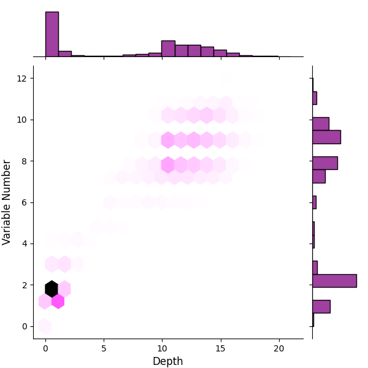

# assessor
Assessor, as an _adaptive colloquium_, generates challenging training samples for training of symbolic regression systems like [Boolformer](https://github.com/sdascoli/boolformer). Assessor plays the crucial role of self-play, as in [AlphaZero](https://arxiv.org/abs/1712.01815), yet is tailored to the asymmetry of symbolic regression: 👉 Crafting puzzles is simpler than solving them.

The setup runs like a [GAN](https://arxiv.org/abs/1406.2661). Assessor, a transformer based on [nanoGPT](https://github.com/karpathy/nanogpt), generates Boolean formulas. The formulas are used to train a system, and are labeled easy if the trained system does it, otherwise hard. The Assessor is in turn trained using the labeled formulas to generate more challenging samples.

The project is young and moving quickly. Currently, the trained system is simulated by a script that labels a formula as easy/hard, if after simplification, its depth is less/more than a given threshhold. As assessor learns to generate formulas with more depth, the threshhold is increased. 

## Results
After just 330K iterations, Assessor generates formulas that, after simplification, 
52.7% of them have both depth >= 6 and >= 6 variables (for training log see [cwd/train_log.txt](cwd/train_log.txt))

<p align="center">
  
  
</p>

## run the model
[](https://colab.research.google.com/github/majdoddin/assessor/blob/main/run.ipynb)

First, navigate to the folder where you keep your projects and clone this repository to this folder:

```bash
git clone https://github.com/karpathy/nanoGPT.git
git clone https://github.com/Majdoddin/assessor.git
```
Dependencies:
```bash
pip install torch matplotlib seaborn boolean.py
```

Then, open the repository folder:

```bash
cd assessor
```

Now, let's just run the trained Assessor. You need a model checkpoint. Download this 300M parameter model I trained within just 300K iterations to generate formulas with depth >= 6:

```bash
wget -P cwd https://huggingface.co/majdoddin/assessor/resolve/main/state-depth-6-2.pt
```
And run it:
```bash
PYTHONPATH="${PYTHONPATH}:path/to/nanoGPT" && cd cwd && python ../assessor.py
```
You'll see each generated formula in Polish normal form, followed by its simplified form, with num of variables and depth:

```
['or', 'and', 'and', 'or', 'and', 'or', 'and', 'or', 'and', 'or', 'and', 'or', 'and', 'x12', 'x4', 'x6', 'x12', 'x3', 'x4', 'x11', 'x5', 'x11', 'x7', 'x10', 'x4', 'x7', 'x10']
depth:12 var_num:8 simpified: x10|(x4&x7&(x10|(x7&(x11|(x5&(x11|(x4&(x3|(x12&(x6|(x12&x4)))))))))))
```
##show results:
```bash
analysis.py cwd/output.txt
```
This generates graphical statistics of the ouput in `cwd`.
## train the model
You can train from scratch or from a checkpoint.
Download a checkpoint 
Set the variables ```checkpoint, sec_round, min_depth, eval, start, end, logf```, and comment the ```to_test_a_checkpoint``` lines in ```assessor.py```.
